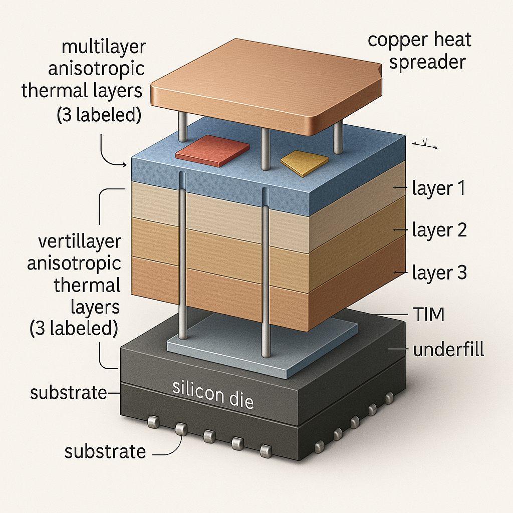

# RL_Thermalpackaging
Visit our website: [Magnative AI](https://www.magnative.ai)
---
This project explores the design automation for the conduction-only stage of **semiconductor cooling**.  
A reinforcement-learning framework is designed to model multilayer thermal packaging, balancing **thermal conductivity**, **cost**, and **manufacturing constraints**.

---
In thermal packaging, the configuration of heat sources and temperature distribution across layers requires careful material and layout choices, including bolts, adhesives, and **thermal interface materials (TIMs)**.  

Real-world problems are complex: each layer may require a specific temperature before deposition of the next, due to material limitations. Here, each layer’s design is treated as an **action**, while the **state observation** records the agent’s current performance metrics such as total thickness, cost, and thermal resistance.

These states can be extended to include maximum inter-layer temperatures or local corrosion effects for stepwise reward shaping.

---

##  Methodology
Each layer’s design pattern is represented by the **fraction of total area** occupied by various materials.  
The **effective thermal conductivity** is computed using the **parallel-resistance model**, and the total stack resistance is derived from the **series combination** of all layers.

  

### Markov Decision Process (MDP)
- **Actions:** Material selection and layer thickness  
- **States:** [
Layer index,
Total thickness so far,
Total cost so far,
Total thermal resistance so far,
Remaining thickness,
Thermal conductivity of last layer
]

- **Reward:** Weighted combination of effective thermal conductivity and cost, optionally constrained by a total budget.

The **Proximal Policy Optimization (PPO)** algorithm is used for training. Although off-policy methods may improve performance, PPO provides a robust and interpretable baseline.

---

## Experimental Setup
All experiments are executed on CPU.  
Discrete layer thicknesses are defined based on **manufacturing resolution** to ensure practical realizability.  
The base model uses **three layers**, with adjustable minimum and maximum thicknesses.

---

##  Results

### Multi-Objective Case
| Layer | Materials | Thickness (m) | k (W/m·K) | Cost |
|:------|:-----------|:--------------|:-----------|:------|
| 1 | c3, c2, d2 | 0.005000 | 209.000 | 3.900000 |
| 2 | c2, d2 | 0.000800 | 60.000 | 0.160000 |
| 3 | c3, c3, d1 | 0.004752 | 178.000 | 2.471300 |
| **Total** | — | **0.010552** | **164.9957** | **6.5313** |

---

### Constrained Case (Cost ≤ 2.0)
| Layer | Materials | Thickness (m) | k (W/m·K) | Cost |
|:------|:-----------|:--------------|:-----------|:------|
| 1 | c3, c4, d2 | 0.004752 | 160.000 | 1.045550 |
| 2 | c2, d2 | 0.000800 | 60.000 | 0.160000 |
| 3 | c3, c3, d4 | 0.005000 | 163.000 | 0.800000 |
| **Total** | — | **0.010552** | **143.1599** | **2.0056** |

The results show that enforcing a cost constraint lowers achievable conductivity but ensures manufacturability and economic feasibility.

---

## Highlights
- Framework adapts easily to new materials, cost constraints, and layer resolutions.  
- PPO agent balances cost-performance trade-offs effectively.  
- Reward normalization was omitted since the model showed stable trade-off behavior.  

---

